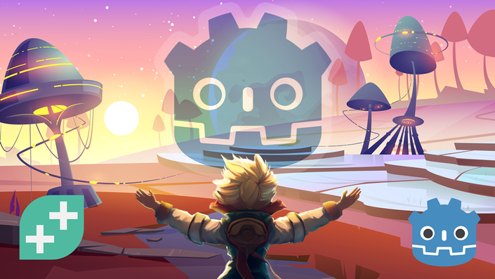

# Complete Godot 2D: Develop Your Own 2D Games Using Godot 4

My progress in the [**GameDev.tv Team**](https://www.udemy.com/course/complete-godot-4-game-developer-2d-online-course/?couponCode=ST15MT31224) course.

## Introduction & Setup :heavy_check_mark:

- [x] Welcome To The Course
- [x] Downloading Godot
- [x] Create A Project
- [x] Exploring Godot's Interface
- [x] More Interface Exploration
- [x] Community & Support
- [x] Accessing Our Projects

## Speedy Saucer

- [ ] Section Intro - Speedy Saucer
- [ ] Project Setup
- [ ] Nodes & Scenes
- [ ] Rigidbody2D & Collision Shapes
- [ ] Instancing Scenes
- [ ] Editing Instances
- [ ] Parent & Child Relationship
- [ ] Draw Order & Z Index
- [ ] Intro To Scripting
- [ ] Functions & Printing Text
- [ ] Number Operations & More Printing
- [ ] Introducing Variables
- [ ] Function Parameters/Arguments
- [ ] Vector2 & apply_impulse( )
- [ ] Processing & apply_force( )
- [ ] If Statement & Comparison Operators
- [ ] Getting Input
- [ ] Variable Scope
- [ ] Function Return Values
- [ ] Following The Player With Camera2D
- [ ] Making The Maze
- [ ] Using Signals To Reset The Game
- [ ] Parallax Background & Text Labels
- [ ] Wrap Up - Speedy Saucer

## Alien Attack

- [ ] Section Intro - Alien Attack
- [ ] Project Setup & Player Scene
- [ ] Player Movement
- [ ] Clamping Players Position
- [ ] Rocket Scene & Movement
- [ ] Understanding Delta Time
- [ ] Shooting Rockets
- [ ] Creating References To Nodes
- [ ] Deleting Unwanted Rockets
- [ ] Enemy Scene & Movement
- [ ] Enemy Spawner Scene
- [ ] Spawn Enemy Function
- [ ] Shooting Enemies & Collision Layers
- [ ] Enemy Deathzone
- [ ] Lives & Custom Signals
- [ ] Scoring & Enemy Died Signal
- [ ] Score UI
- [ ] Lives UI
- [ ] Game Over Screen
- [ ] Adding Sound Effects
- [ ] Flame Particle Effect
- [ ] Path Enemy
- [ ] Adding Path Enemy To The Spawner
- [ ] Wrap Up - Alien Attack

## Martian Mike

- [ ] Section Intro - Martian Mike
- [ ] Project Setup - Martian Mike
- [ ] Animated Sprites
- [ ] Player Movement
- [ ] Boolean Operators
- [ ] Updating Animations
- [ ] Deathzone
- [ ] Jump Pad
- [ ] Traps
- [ ] Animation Player
- [ ] Arrays & Groups
- [ ] The For Loop
- [ ] Tilemap Basics
- [ ] Tilemap Terrains (Autotile)
- [ ] Scrolling Background
- [ ] Start Area
- [ ] Exit Area
- [ ] Changing Scenes
- [ ] More Levels
- [ ] Level Timer
- [ ] Timer HUD
- [ ] Win Screen
- [ ] Start Menu
- [ ] Level Design
- [ ] Autoloads (Singleton Pattern)
- [ ] One-Time Sound Effects
- [ ] Wrap Up - Martian Mike

## Bonus

- [ ] Bonus: Access to C# Conversions of GDScript Projects